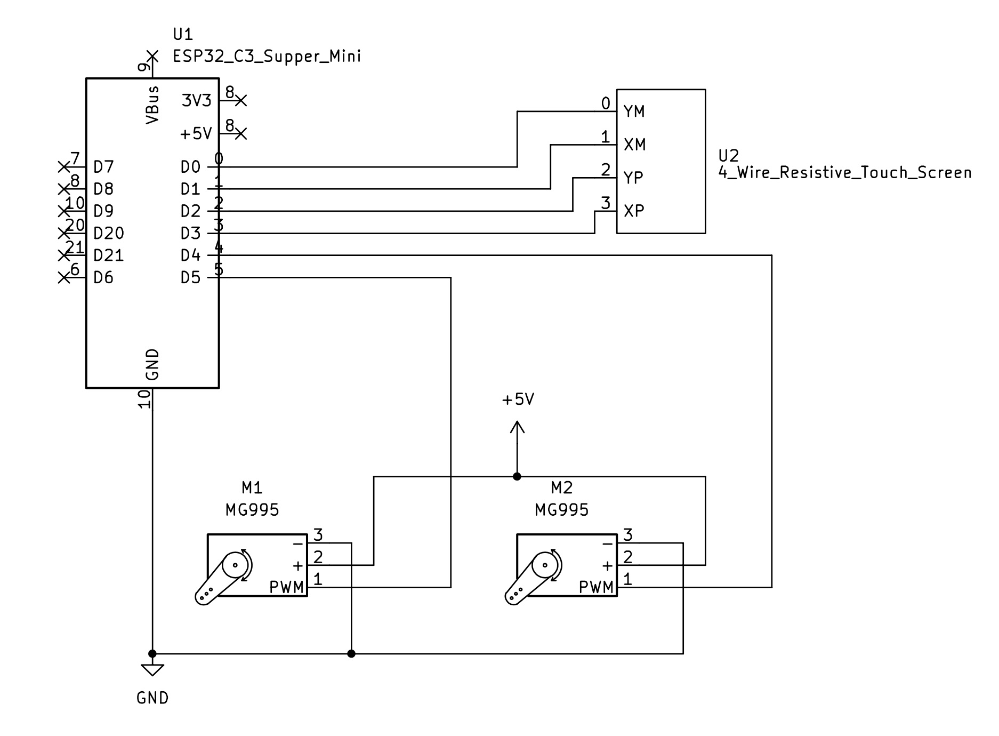
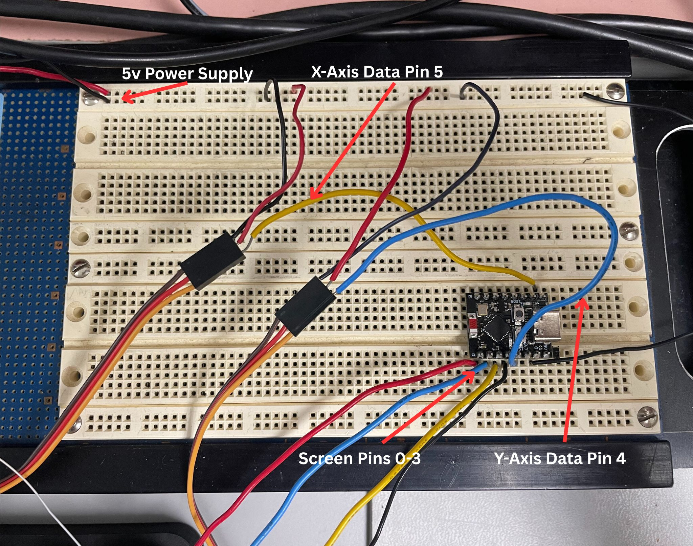

# Ball and Plate Control System

*Click the image above to watch a demo of the system in action!*

A dynamic balancing system that uses an **ESP32-C3 Super Mini**, **MG995 servos**, and a **resistive touchscreen** to control the position of a ball on a plate. The system implements **modern control theory** for real-time position stabilization and uses **6302view** for visualization and debugging.

## Features

- Real-time ball position control using state-space or observer-based feedback
- Circular pattern sert point option
- Input via resistive touchscreen for ball position sensing
- Output actuation using MG995 servos
- Visualization with **6302view**
- Built on the ESP32-C3 Super Mini platform

## Components Used

| Component              | Description                                |
|------------------------|--------------------------------------------|
| ESP32-C3 Super Mini    | Microcontroller for control and I/O        |
| MG995 Servos (x2)      | Control pitch and roll of the plate        |
| M2x65mm Linkage Rod | Linkage Rod used to connect plate to servo motors |
| M2 Metal Clevis    | Clevis used to connect the rod to the servo and top plate |
| Universal Joint Coupler | 10mm inner diameter universal joint |
| 7/8" Stainless Steel Ball | Ideal ball size for system and plate |
| 4-Wire Resistive Touchscreen | Senses ball position (165mm by 100mm)  
| 6302view               | PC-based visualization & tuning tool       |
| 5v Power Supply           | Stable 5V source for servos and ESP32      |

## Wiring Setup

| ESP32-C3 Pin | Connection                       |
| ------------ | -------------------------------- |
| 5V           | Servo power supply, can use external power supply |
| GND          | Common ground for all components |
| Pin 5       | Servo X PWM signal               |
| Pin 4        | Servo Y PWM signal               |
| Pin 0      | Touchscreen X+ (analog read)     |
| Pin 2        | Touchscreen X- (output control)  |
| Pin 3       | Touchscreen Y+ (output control)  |
| Pin 1        | Touchscreen Y- (analog read)     |

## Setup Instructions

Follow these steps to set up the Ball and Plate Control System:

1. **Hardware Assembly**:
   - Start by 3D printing the top tray and bottom base
   - Once printed mount the motors by screwing them into the two posts
   - Connect the top tray and bottom base together using the universal joint
   - Finally use the metal clevises and linkage rods to connect the motors to the top tray
   - Wire the components as per the wiring diagram provided in the **Wiring Setup** section.

2. **Software Setup**:
   - Install the required development environment for the ESP32-C3 (e.g., [PlatformIO](https://platformio.org/) or Arduino IDE).
   - Open the project in your development environment and upload the firmware to the ESP32-C3.

3. **6302view Setup**:
   - Download and install **6302view** from its [GitHub repository](https://github.com/almonds0166/6302view).
   - Connect the ESP32-C3 to your PC via USB or Wi-Fi.
   - Run **6302view** and configure the serial or Wi-Fi connection to the ESP32-C3.
   - Use the offset sliders in **6302view** to level the plate if necessary.

5. **Testing**:
   - Power on the system and ensure all components are functioning correctly.
   - Use **6302view** to monitor the ball position and adjust the control parameters as needed.

## 6302view Integration

- **Purpose**: Enables real-time monitoring and set point placement of system over serial communication.

- **Visualized Parameters**:
  - Current ball position (X, Y)
  - Currently commented out servo command plots
  - Target/reference position slider
  - Axis Offset sliders to account for uneven surfaces
  - Circle toggle to target a circular pattern for the ball

## Control Theory

This project uses a **state-space feedback controller** designed using modern control theory. The first step in finding our state space model was deriving the equation using Newton's Laws.

**Deriving the Equations of Motion Using Newton's Laws**:

The first step in designing the control system is to derive the equations of motion for the Ball and Plate system. This is done using **Newton's Second Law**:

\
F = ma and M = Iα
\

#### Assumptions:
- The ball rolls without slipping on the plate.
- The plate's motion is limited to small angular displacements (linearization assumption).
- Constant gravitational force acts on the ball.
- No additional rotation on ball.
- No unwanted movement in plate.

#### Steps:
1. **Free Body Diagram**:
   - Consider the forces acting on the ball:
     - Gravitational force \(mg\) acting downward.
     - Normal force \(N\) from the plate.
     - Frictional force \(Ff\) preventing slipping.

2. **Equations of Motion**:
   - For the ball in the \(x\)-direction:
     \
     Ff - w sin(θ) = -ma
     \
   - For the rotation of the ball:
   \
    FfR = Iα
   \

3. **Combine Equations**:
   - Substitute the torque equation into the force equations to eliminate \(F_f\).
   \
    R(w sin(θ) - ma) = Iα
   \

4. **Simplify**:
   - By plugging in the moment of inertia for a solid sphere:
   \
    2/5mR^2
   \
   - With additional algebraic simplification and a small angle approximation of sin we get:
   \
   a = 5/7gθ
   \

This equation describes the behavior of the ball for both the respective x and y accelerations in terms of the plate angle θ.

---

In the next step, these equations will be used to construct the **state-space representation** of the system.

## Potential Improvements

- **Hardware Improvements**
  - The 3D printed structure had some minor warping on the top piece
    - Modifications to CAD model could be made to reduce this warping
    - Printing procedure could change to modify this as well
  - Cheap servos were used which although had enough power and range of motion the clarity is low
    - Higher quality, more accurate servos could be used to ensure desired angle is output
    - 3 or more servos could have been used in a different arrangement to produce more accurate plate angle outputs

- **Software Improvements**
  - Both G and K matrices can be fine tuned to ensure optimal convergence
  - Additional plots can be added using 6302 view
    - Currently code for angles is commented out
    - Observer state plots could be added

    
